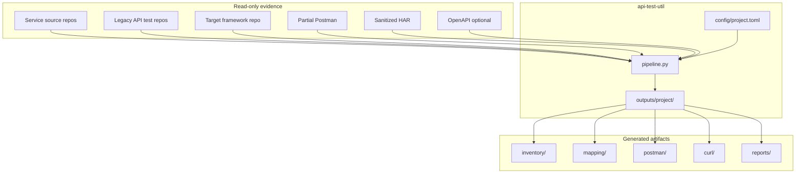
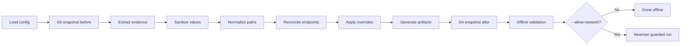
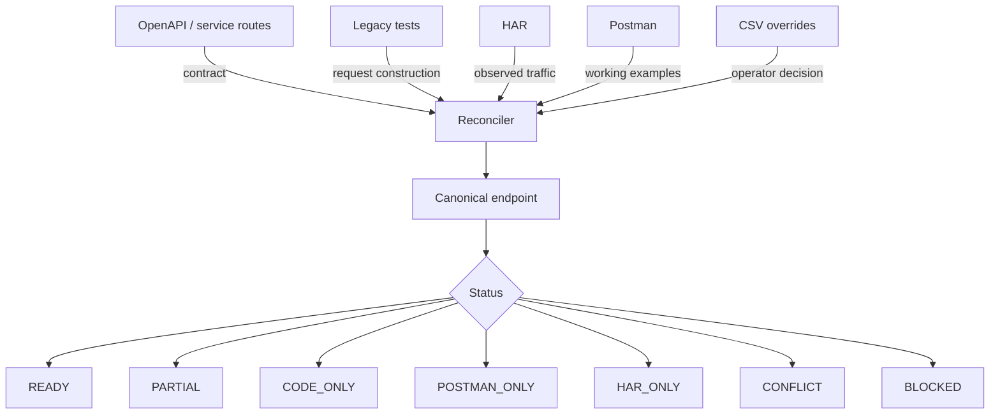
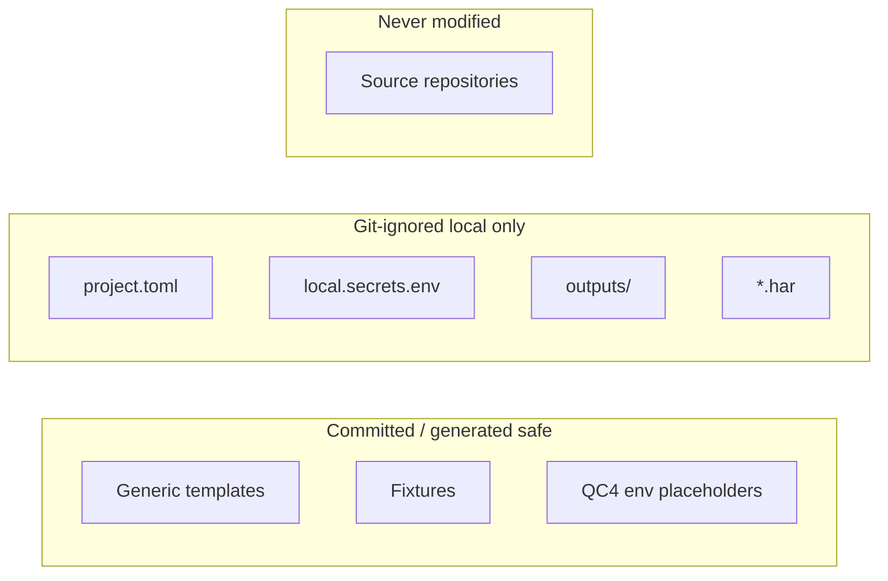

# Architecture

## Design goal

Build one local utility that reconstructs a manual-testing Postman collection from incomplete API evidence without changing source repositories or requiring cloud credentials.

---

## System context

---

## Module map

| Module | Responsibility |
|---|---|
| `config.py` | TOML loading, path resolution, QC4-only checks, custom parser configuration |
| `discovery.py` | Repository, Postman, environment, HAR, and OpenAPI extraction |
| `sanitize.py` | Token/header redaction, HAR payload templating, environment-value safety |
| `normalize.py` | URL splitting, route-parameter normalization, Postman/cURL variable conversion |
| `reconcile.py` | Canonical endpoint grouping, source precedence, confidence/status calculation |
| `generate.py` | CSV/XLSX mapping, Collection v2.1, QC4 environment, cURL previews, Markdown reports |
| `pipeline.py` | Read-only orchestration and source-repository before/after Git checks |
| `tools/validate_collection.js` | Structural validation with the Postman Collection SDK |
| `scripts/run_newman_safe.py` | Explicitly gated live execution with local secret injection |

---

## Processing pipeline

### Step detail

1. Load `config/project.toml` and resolve absolute paths.
2. Snapshot `git status --porcelain` for every configured repository.
3. Scan repositories (Spring `@*Mapping`, JAX-RS `@Path`, RestAssured, fetch, custom patterns).
4. Import partial Postman collections and environments (UTF-8 BOM tolerant).
5. Import sanitized HAR and optional OpenAPI.
6. Redact tokens, passwords, and concrete identifiers before they enter the evidence model.
7. Normalize method + path; apply `strip_prefixes` and `path_aliases` for BFF/gateway reconciliation.
8. Group evidence into canonical endpoints with field-level provenance.
9. Apply documented CSV overrides only.
10. Write inventory, mapping, Postman collection, environment, cURL, and reports.
11. Re-check Git status; **fail** if any source repository changed.
12. Run Python tests, distribution validation, and Postman SDK validation.

---

## Evidence reconciliation

Precedence is **field-specific**. A higher-ranked source does not erase lower-ranked evidence; all sources remain visible in the migration matrix.

---

## Evidence precedence

| Rank | Source | Best for |
|---|---|---|
| 1 | OpenAPI / service routes | Method, path, request schema |
| 2 | Legacy integration tests | Request construction, variables |
| 3 | Sanitized HAR | Gateway/BFF paths, observed QC4 behavior |
| 4 | Partial Postman | Descriptions, variables, working examples |
| 5 | CSV overrides | Documented conflict resolution |

---

## Status model

| Status | Meaning |
|---|---|
| `READY` | Postman + at least one corroborating source, no conflict |
| `PARTIAL` | Multi-source but needs review |
| `CODE_ONLY` | Found only in code/spec/tests |
| `POSTMAN_ONLY` | Found only in Postman |
| `HAR_ONLY` | Observed only in runtime traffic |
| `CONFLICT` | Material evidence disagrees |
| `BLOCKED` | Operator-marked not executable yet |

These are migration-readiness statuses, not code-coverage percentages.

---

## Security boundaries

- Generated environment files contain **placeholders only**.
- `scripts/run_newman_safe.py` requires `--allow-network` and never puts secrets on the command line.
- Source repositories are read-only; pipeline aborts on any Git status change.

---

## Technology stack

| Layer | Technology |
|---|---|
| Core engine | Python 3.11+, TOML config |
| Static analysis | Ruff |
| Tests | pytest |
| Collection validation | Node.js + postman-collection SDK |
| Live execution | Newman (guarded wrapper) |
| Mapping export | CSV + XlsxWriter |

---

## Extension points

- `[[custom_patterns]]` in `project.toml` for project-specific route annotations
- `templates/endpoint_overrides.csv` for documented conflict resolution
- `[normalization.path_aliases]` for BFF-to-service path mapping
- See [PARSER-EXTENSION-GUIDE.md](PARSER-EXTENSION-GUIDE.md)
